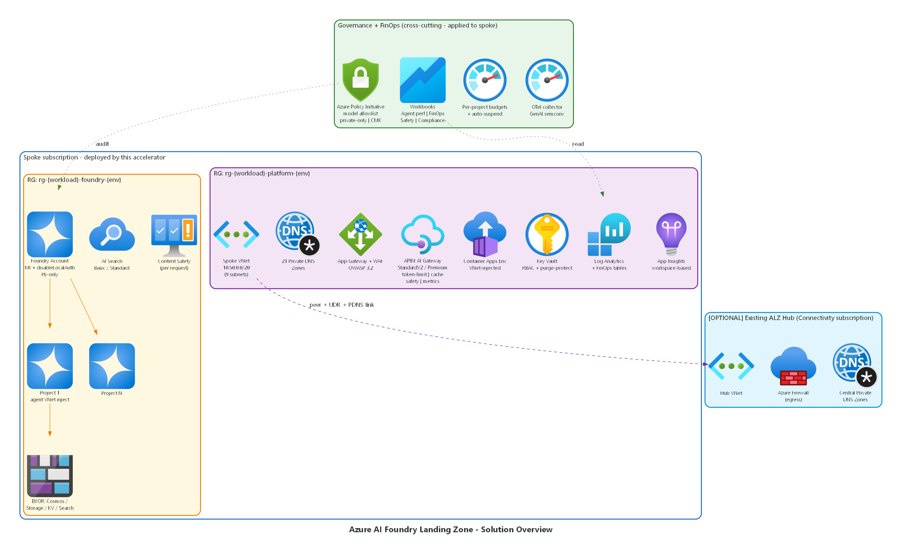
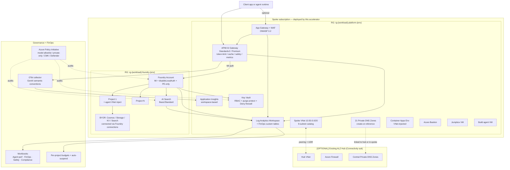

# Azure AI Foundry Landing Zone + FinOps Accelerator

> **A production-ready, dual-stack (Bicep **and** Terraform) Azure landing zone for Microsoft Foundry / Azure OpenAI workloads — with FinOps showback, AI Gateway governance, content safety, and full observability baked in.**

[]() []() []() []()

This repository ships an **opinionated, enterprise-grade landing zone** for hosting Microsoft Foundry (the Azure AI Foundry / Cognitive Services unified service) inside an Azure subscription. It is designed to be **deployed as-is for a smoke test in under 10 minutes**, or **adopted into an existing ALZ-style hub-and-spoke topology** with a parameter flip — no template rewriting.

Both **Bicep** and **Terraform** are first-class — they ship the same architecture, are validated by the same CI gates, and a parity test asserts the two stacks stay in sync.

---

## Table of contents

- [What is this?](#what-is-this)
- [When should I use this?](#when-should-i-use-this)
- [Architecture at a glance](#architecture-at-a-glance)
- [What gets deployed](#what-gets-deployed)
- [Quick start (5 commands)](#quick-start-5-commands)
- [Blueprints](#blueprints)
- [Toggles — what to turn on/off](#toggles--what-to-turn-onoff)
- [Networking modes](#networking-modes)
- [CI / quality gates](#ci--quality-gates)
- [Repository layout](#repository-layout)
- [Cost guidance](#cost-guidance)
- [Documentation index](#documentation-index)

---

## What is this?

A **complete Azure landing zone** built around three pillars:

| Pillar | What it gives you |
|---|---|
| **🏗️ Landing zone** | Spoke VNet (`10.50.0.0/20`) with a 9-subnet catalog, 21 private DNS zones, Foundry account + project(s) with private endpoints, AI Search, Key Vault, Log Analytics, App Insights — everything pre-wired with managed identities, RBAC, and `disableLocalAuth=true`. |
| **🛡️ Guardrails** | Azure Policy initiative (model allowlist, private-only, MI-only, CMK), APIM AI Gateway policies (token limit, semantic cache, prompt shields, content safety, OTel emit metrics), Defender for AI auto-enable. |
| **📊 Observability + FinOps** | Workbooks for agent performance, FinOps showback, content safety, compliance drift; custom Log Analytics tables for per-project cost lineage (`CostCenter`, `Project`, `UseCase`); auto-suspend Logic App when budgets exceed; OpenTelemetry GenAI semantic conventions end-to-end. |

The accelerator is **forked-from-scratch from the Microsoft AVM patterns** for `avm-ptn-aiml-landing-zone` and the `Azure-Samples/AI-Gateway` FinOps framework, with first-class **dual-IaC** support and a fully wired **CI pipeline**.

---

## When should I use this?

### ✅ Good fit
- You're standing up **Microsoft Foundry / Azure OpenAI** in an enterprise Azure tenant and need the hardened defaults, RBAC, and observability **out of the box** instead of building them yourself.
- You already have an **ALZ hub** (Connectivity subscription with hub VNet, firewall, central private DNS zones) and want a **spoke** that snaps into it via one parameter (`networkMode = 'hub-connected'`).
- You need **per-project / per-team cost lineage** for AI spend (FinOps showback by `CostCenter`, `Project`, `UseCase`) and want it driven by APIM AI Gateway metrics — not screen-scraped from Cost Management.
- You want **both Bicep and Terraform** as first-class options because different teams in your org prefer different stacks.
- You need a **reference implementation** of the Microsoft Foundry enterprise readiness checklist (CMK, MI-only, PE-only, model allowlist, content safety, agent VNet injection) you can audit and adapt.

### ❌ Not a good fit
- You only need a **single dev sandbox** with public-internet Foundry — just use `az cognitiveservices account create` directly.
- You want a **multi-region active/active** Foundry footprint out of the box (this ships single-region with a documented DR pattern; multi-region is a Phase 2 you'd implement on top).
- You want a **fully greenfield hub** with Firewall + DDoS + Bastion in the Connectivity sub — use [`Azure/terraform-azurerm-avm-ptn-aiml-landing-zone`](https://registry.terraform.io/modules/Azure/avm-ptn-aiml-landing-zone/azurerm/latest) (a hub stub is included here for future merging but the greenfield hub is currently P9 carryover).
- You don't have Owner or User Access Administrator on at least one Azure subscription (the accelerator creates role assignments).

### Typical use cases

1. **POC / pilot** — pick the `smoke` blueprint, deploy to a sandbox sub, demo Foundry + APIM AI Gateway + cost workbook in 10 min (~$5/day if left running).
2. **Customer-zero pattern** — your platform team adopts this as the reference landing zone, your app teams use the `pipelines/agent-factory` pattern to self-serve new projects under policy.
3. **Brownfield retrofit** — you already have Foundry deployed ad-hoc; assign the policy initiative in `policy/` at audit-only, run the [Enterprise Brownfield Remediation Plan](docs/Enterprise-Brownfield-Remediation-Plan.md) playbook in 9 waves.
4. **Hub-spoke integration** — your network team owns the hub; you own the AI spoke; one parameter (`networkMode = 'hub-connected'`) + three input values (hub VNet ID, firewall private IP, existing PDNS map) wire everything together.
5. **AI Gateway adoption** — keep your existing APIM; import the policies from `apim-policies/` per [docs/existing-apim-byo.md](docs/existing-apim-byo.md).

---

## Architecture at a glance



> Generated from [`docs/diagrams/generate.py`](docs/diagrams/generate.py) using the official Microsoft Azure architecture icon set (via [`mingrammer/diagrams`](https://diagrams.mingrammer.com/)). Regenerate with `python docs/diagrams/generate.py`.

For request lifecycle and per-subnet topology, see **[docs/architecture.md](docs/architecture.md)**.

<details>
<summary>Text fallback (Mermaid source)</summary>



</details>

See [docs/architecture.md](docs/architecture.md) for detail (subnet map, hub-connected dataflow, sequence diagrams).

---

## What gets deployed

**Every blueprint** deploys a core foundation; **toggles** add optional layers.

### Foundation (always deployed)

| Resource | Type | Default SKU | Notes |
|---|---|---|---|
| Spoke VNet | `Microsoft.Network/virtualNetworks` | `10.50.0.0/20` | 9-subnet catalog (8 active + 1 reserved) |
| 2× Network Security Groups | `Microsoft.Network/networkSecurityGroups` | — | AIFoundry + PrivateEndpoint subnets |
| 21× Private DNS Zones | `Microsoft.Network/privateDnsZones` | — | `cognitiveservices`, `openai`, `aiServices`, `search`, `vaultcore`, `azconfig`, `cosmos.*` (7 variants), `blob/file/queue/table/dfs/web`, `azure-api.net`, `azurecr.io` — created in standalone mode, linked to existing in hub-connected mode |
| 21× VNet Links | `Microsoft.Network/privateDnsZones/virtualNetworkLinks` | — | One per zone |
| Log Analytics Workspace | `Microsoft.OperationalInsights/workspaces` | PerGB2018 | + 3 custom tables (`AiUsage_CL`, `AiCost_CL`, `AiAgentSpan_CL`) |
| Application Insights | `Microsoft.Insights/components` | workspace-based | `DisableLocalAuth: true`, `Application_Type: web` |
| Key Vault | `Microsoft.KeyVault/vaults` | standard | RBAC, purge-protect on, **firewall Deny** + AzureServices bypass |
| Key Vault Private Endpoint | `Microsoft.Network/privateEndpoints` | — | resolves `vaultcore.azure.net` |
| Foundry Account | `Microsoft.CognitiveServices/accounts` | AIServices `S0` | MI, `disableLocalAuth=true`, `publicNetworkAccess=Disabled` |
| Foundry Project(s) | `Microsoft.CognitiveServices/accounts/projects` | — | 1+ per blueprint |
| Model Deployment(s) | `Microsoft.CognitiveServices/accounts/deployments` | `gpt-4o-mini` default | Per-model TPM cap |
| Foundry Private Endpoint | `Microsoft.Network/privateEndpoints` | — | resolves `cognitiveservices.azure.com` + `openai.azure.com` |
| AI Search | `Microsoft.Search/searchServices` | Basic | MI auth, `westus2` default (region-flexible) |
| 2× Resource Groups | `Microsoft.Resources/resourceGroups` | — | `rg-{workload}-platform-{env}` + `rg-{workload}-foundry-{env}` |
| Data Collection Endpoint + Rule | `Microsoft.Insights/dataCollection*` | — | Routes custom LA tables |
| 1+ Workbook | `Microsoft.Insights/workbooks` | — | FinOps showback (always); Agent Perf + Safety added in full |
| Scheduled Query Rule | `Microsoft.Insights/scheduledQueryRules` | — | Budget threshold alert |
| Diagnostic Settings | `Microsoft.Insights/diagnosticSettings` | — | On Foundry, KV, Search, NSGs, VNet → LAW |

### Optional layers (per `components.<x>.deploy` toggle)

| Toggle | Adds | Subnet used | Typical extra cost |
|---|---|---|---|
| `components.apim.deploy` | APIM + AI Gateway policies (token limit, semantic cache, content safety, emit metrics, prompt shields), Foundry-RBAC wiring | `APIMSubnet` (`/26`) — only if VNet mode | ~$38/day @ StandardV2 |
| `components.standaloneSearch.deploy` | Standalone AI Search service (when Foundry-embedded search isn't enough) | `PrivateEndpointSubnet` | ~$2/day @ Basic |
| `components.appGateway.deploy` | App Gateway WAF_v2 + OWASP 3.2 + public IP | `AppGatewaySubnet` (`/24`) | ~$10/day |
| `components.bastion.deploy` | Azure Bastion Basic + public IP | `AzureBastionSubnet` (`/26`) | ~$5/day |
| `components.jumpvm.deploy` | Windows Jumpbox VM | `JumpboxSubnet` (`/26`) | ~$2/day @ B2ms |
| `components.buildvm.deploy` | Linux build agent VM | `DevOpsBuildSubnet` (`/26`) | ~$2/day @ B2s |
| `components.containerAppsEnv.deploy` | Container Apps Environment (VNet-injected) for agent runtimes | `ContainerAppEnvironmentSubnet` (`/23`) | ~$3/day idle |
| `components.notifications.deploy` | Action Group + Logic App (Teams webhook + email) for cost/safety alerts | — | <$0.10/day |
| `components.otelCollector.deploy` | OpenTelemetry collector ConfigMap (deploy target = your existing AKS / CAE) | — | $0 |

### Governance assets (always shipped, opt-in to assign)

- `policy/` — 12-control Azure Policy initiative (model allowlist, private-only, MI-only, CMK, Defender DINE, tag enforcement)
- `apim-policies/` — AI Gateway XML policies (`token-limit`, `emit-token-metric`, `content-safety`, `prompt-shields`, `semantic-cache`)
- `rbac/` — Foundry RBAC role map + PIM guidance + assignment templates
- `content-safety/` — System prompt prefix + blocklists
- `finops/` — Budgets module, chargeback KQL, auto-suspend Logic App
- `governance/shadow-ai/` — Conditional Access + Defender for Cloud Apps + Purview DLP starter pack
- `governance/agent-runtime/` — Policy-driven agent tool governance starter kit

---

## Quick start (5 commands)

```powershell
# 1. Sign in + select target subscription
az login
az account set --subscription <your-sub-id>

# 2. (Pick ONE) — Bicep
./scripts/deploy.ps1 -Mode smoke -Location eastus2

# 2. (Pick ONE) — Terraform
cd infra/terraform
terraform init
terraform apply -var-file=blueprints/smoke/smoke.tfvars `
  -var="subscription_id=<your-sub-id>" `
  -var="jumpvm_admin_password=<your-password>" `
  -var="buildvm_ssh_public_key=<your-public-key>"

# 3. Verify deployment health (works for both stacks)
./scripts/smoke-verify.ps1 -Workload klzfin -Env dev -SubscriptionId <your-sub-id>

# 4. (Optional) Cross-stack parity check
./scripts/parity-diff.ps1 -Blueprint smoke -SubscriptionId <your-sub-id>

# 5. Teardown
./scripts/deploy.ps1 -Mode teardown   # Bicep
# or: terraform destroy (Terraform)
```

For a step-by-step walkthrough including pre-reqs, see **[docs/deployment-guide.md](docs/deployment-guide.md)**.

---

## Blueprints

Five paired blueprints (one `.bicepparam` + one `.tfvars` each — same architecture, different toggle settings):

| Blueprint | Network mode | Components on | Typical use | Approx. resources |
|---|---|---|---|---|
| **`smoke`** | standalone | foundation only | 10-min POC, CI sanity check | ~55 |
| **`poc-standalone-spoke`** | standalone | foundation + standalone search | POC with realistic data plane | ~70 |
| **`poc-hub-connected`** | hub-connected | foundation only, attaches to existing hub | Brownfield POC, no firewall create | ~50 |
| **`prod-standalone-with-fw`** | standalone | + APIM + WAF + Bastion + JumpVM + BuildVM + CAE | Fully self-contained prod (greenfield, no hub) | ~110 |
| **`prod-hub-connected`** | hub-connected | + APIM + WAF + Bastion + JumpVM + BuildVM + CAE | **Recommended enterprise default** — spoke under an existing ALZ hub | ~90 |

Plus two convenience parameter sets at the root for ad-hoc usage: `full.bicepparam`/`full.tfvars` (standalone + APIM) and `stage-b-toggles.*` (all toggles on).

Each blueprint is in `infra/{bicep,terraform}/blueprints/<name>/`.

---

## Toggles — what to turn on/off

The `components` object in Bicep / `components` map in Terraform controls every optional resource. Flip any value to `deploy: false` and that resource (plus its subnet usage, RBAC, DNS wiring, and cost) drops cleanly out of the plan — no module-code edits required.

**Defaults below are for the `prod-hub-connected` blueprint (the recommended enterprise default):**

```bicep
// infra/bicep/blueprints/prod-hub-connected/prod-hub-connected.bicepparam
components = {
  apim:             { deploy: true,  sku: 'StandardV2', networkMode: 'internal' }
  appGateway:       { deploy: true,  sku: 'WAF_v2', wafEnabled: true }
  bastion:          { deploy: true,  sku: 'Standard' }
  jumpvm:           { deploy: true,  sku: 'Standard_B2s' }
  buildvm:          { deploy: false, sku: 'Standard_B2s' }
  containerAppsEnv: { deploy: true }
  standaloneSearch: { deploy: true,  sku: 'standard' }
  notifications:    { deploy: true }
  otelCollector:    { deploy: false }   // wire to your existing collector
}
```

```hcl
# infra/terraform/blueprints/prod-hub-connected/prod-hub-connected.tfvars
apim               = { deploy = true,  sku = "StandardV2", network_mode = "internal" }
app_gateway        = { deploy = true,  sku = "WAF_v2", waf_enabled = true }
bastion            = { deploy = true,  sku = "Standard" }
jumpvm             = { deploy = true,  sku = "Standard_B2s" }
buildvm            = { deploy = false }
container_apps_env = { deploy = true }
standalone_search  = { deploy = true,  sku = "standard" }
notifications      = { deploy = true }
otel_collector     = { deploy = false }
```

### Cheat-sheet — pick a starting point

| If you want… | Set | Result |
|---|---|---|
| Cheapest possible smoke test (~$2/day) | All toggles `false`, blueprint = `smoke` | Foundry + KV + LAW + Search Basic only |
| POC with realistic data plane | `standaloneSearch=true`, blueprint = `poc-standalone-spoke` | + dedicated AI Search |
| POC that lives inside an existing hub | blueprint = `poc-hub-connected`, set `hubVnetResourceId` + `existingPrivateDnsZones` | Spoke peered into hub, reuses central PDNS |
| Full enterprise prod, no existing hub | All toggles `true`, blueprint = `prod-standalone-with-fw` | Self-contained: APIM + WAF + Bastion + VMs + CAE |
| Full enterprise prod, attaching to existing ALZ hub | All toggles `true`, blueprint = `prod-hub-connected` | Same as above but peered into hub, no firewall create |
| Bring-your-own APIM | `apim.deploy=false`, import `apim-policies/*.xml` into your APIM | Use [docs/existing-apim-byo.md](docs/existing-apim-byo.md) |
| No public ingress (private agents only) | `appGateway.deploy=false`, `bastion.deploy=false` | Internal-only path: APIM internal mode + CAE + Foundry |
| Skip jump host (you have AVD/Bastion elsewhere) | `bastion.deploy=false`, `jumpvm.deploy=false` | Drops AzureBastion + Jumpbox subnets |
| **Force all Foundry traffic through APIM (zero-trust)** | `enforceApimChokepoint=true` (requires `apim.deploy=true` + `apim.networkMode != 'none'`) | Foundry + Search go `publicNetworkAccess=Disabled`; PE subnet NSG denies everything except `APIMSubnet` (+ optional agent/CAE exceptions) |

---

## How traffic flows — APIM as the single chokepoint

By default the accelerator deploys **APIM AI Gateway** as the *recommended* hop, but Foundry's public endpoint stays reachable to anyone with `Cognitive Services User` RBAC — APIM is an **opt-in** governance layer, not a wall.

Flip **`enforceApimChokepoint = true`** and the topology changes from "APIM is the suggested door" to "**APIM is the only door**":

| What flips when `enforceApimChokepoint = true` | Before (default) | After (chokepoint) |
|---|---|---|
| Foundry `publicNetworkAccess` | `Enabled` | `Disabled` (PE-only) |
| Standalone AI Search `publicNetworkAccess` | `Enabled` | `Disabled` |
| Standalone AI Search `disableLocalAuth` | `false` (key + AAD) | `true` (AAD-only) |
| Standalone AI Search PE | *not created* | created + wired to `privatelink.search.windows.net` |
| `PrivateEndpointSubnet.privateEndpointNetworkPolicies` | `Disabled` (NSGs ignored) | `NetworkSecurityGroupEnabled` (NSGs enforced) |
| PE subnet NSG | open | `Allow APIMSubnet→PE:443` + `Allow AzureLoadBalancer` + `Deny *` |

**Bypass flags** (only meaningful when chokepoint is on):

- `allowAgentSubnetBypass = true` (default) — also allow `AIFoundrySubnet → PE`. Required when `enableFoundryAgentInjection = true` because the Standard Agent Service connects to Foundry over its injected NIC, not Microsoft-internal backbone.
- `allowCaeBypass = false` (default) — also allow `ContainerAppEnvironmentSubnet → PE`. Turn this on if you host first-party apps inside CAE that need to call Foundry/Search without going through APIM. **Tradeoff:** anything in CAE bypasses your token-limit / content-safety / semantic-cache policies.

**Hard preconditions** (build/plan fails fast with a clear error if violated):

1. `components.apim.deploy = true`
2. `components.apim.networkMode ∈ {external, internal}` — `none` means APIM has no VNet integration, so it can't reach a private Foundry.
3. If `components.standaloneSearch.deploy = true`, then `searchLocation == location` — the PE for Search has to live in the spoke VNet's region.

**Blueprint defaults:**

| Blueprint | `enforceApimChokepoint` | Why |
|---|---|---|
| `smoke` | `false` | Pure smoke test — no APIM in this blueprint |
| `poc-standalone-spoke` | `false` | Dev-friendly; turn on once your team has APIM keys provisioned |
| `poc-hub-connected` | `false` | Same reasoning; flip once APIM is in `internal` mode |
| `prod-standalone-with-fw` | `false` | Customer may need direct PE for Power Platform / Logic Apps / on-prem |
| **`prod-hub-connected`** | **`true`** | Recommended enterprise default: hub FW + APIM = layered defense |

See [docs/deployment-guide.md](docs/deployment-guide.md#enforcing-the-apim-chokepoint) for the post-deploy verification checklist.

---

## Networking modes

### `standalone` (greenfield)
- Creates the spoke VNet, all 21 private DNS zones in the spoke
- Foundry/KV/Search PEs resolve via the in-spoke PDNS
- No hub peering, no UDR
- Good for: POCs, isolated sandboxes, customer-zero before hub exists

### `hub-connected` (brownfield — recommended for enterprise)
- Creates the spoke VNet, peers it to your existing hub VNet (and optionally creates the reverse peer)
- Skips creating PDNS zones — instead **links the spoke to your existing central zones** via `existingPrivateDnsZones` map
- Optionally creates a UDR sending `0.0.0.0/0` through the hub firewall (toggle `enableForcedTunneling`)
- Required inputs:
  - `hubVnetResourceId` — full resource ID of your hub VNet
  - `hubFirewallPrivateIp` — for the UDR next hop
  - `existingPrivateDnsZones` — map of zone name → resource ID of your central zone

See [docs/hub-spoke-integration.md](docs/hub-spoke-integration.md) for the wiring runbook.

---

## CI / quality gates

The repo ships **three GitHub Actions workflows** (`.github/workflows/`) that run on every PR and nightly:

| Workflow | Trigger | What it does |
|---|---|---|
| `pr.yml` | PR to `main` on `infra/`, `scripts/`, `.github/` changes | **Terraform** matrix (8 tfvars × fmt + init + validate + tflint + plan) · **Bicep** matrix (5 bicepparam × build + PSRule on canonical template + `az deployment sub what-if`) · **Security** (trivy + checkov) · **Cross-stack parity diff** (TF↔Bicep on smoke) |
| `nightly-sandbox.yml` | cron `0 7 * * *` UTC + `workflow_dispatch` | Full deploy → `smoke-verify.ps1` → teardown loop. Stack + blueprint configurable. |
| `release.yml` | tag push `vX.Y.Z` | SemVer validation + git-log release notes + GitHub release |

All gates are baselined in **[docs/lint-baseline.md](docs/lint-baseline.md)**:
- **tflint** (azurerm v0.29.0): 0 errors, 11 documented warnings
- **PSRule.Rules.Azure** (`Azure.GA_2024_12`): 0 errors, 11 documented fails (all justified)
- **trivy** + **checkov**: 0 unfixed HIGH/CRITICAL; 4 documented skips
- **parity-diff**: 0 unexplained drift beyond [`docs/parity-allowlist.json`](docs/parity-allowlist.json)
- **terraform fmt -recursive**: 0 diff
- **actionlint v1.7.7**: all 3 workflows clean

Required GH secrets (for the workflows to actually fire against Azure):
- `AZURE_CLIENT_ID` — Service principal with OIDC federated credential
- `AZURE_TENANT_ID`
- `AZURE_SUBSCRIPTION_ID`

---

## Repository layout

```
.
├── infra/
│   ├── bicep/
│   │   ├── main.bicep                    Subscription-scope orchestrator
│   │   ├── modules/                      foundation/ · networking/ · ai-platform/ · ai-gateway/ · compute/ · observability/ · finops/
│   │   ├── blueprints/                   5 paired blueprints (1 .bicepparam each)
│   │   └── parameters/                   ad-hoc parameter sets (full, stage-b-toggles, enterprise-hub-connected.sample)
│   └── terraform/
│       ├── main.tf · variables.tf · locals.tf · providers.tf
│       ├── modules/                      Mirror of bicep/modules — same names, same shape
│       ├── blueprints/                   5 paired blueprints (1 .tfvars each)
│       └── parameters/                   ad-hoc parameter sets
├── apim-policies/                       AI Gateway XML policies (importable into BYO APIM)
├── policy/                              Azure Policy initiative (12 controls) + assignment templates
├── rbac/                                Foundry RBAC role map + PIM guidance
├── observability/                       Workbook source + alerts + OTel collector config
├── finops/                              Per-project budgets + chargeback KQL + auto-suspend Logic App
├── content-safety/                      Enterprise system prompt prefix + blocklists
├── governance/
│   ├── shadow-ai/                       Conditional Access + Defender for Cloud Apps + Purview DLP starter
│   └── agent-runtime/                   Policy-driven agent tool governance starter kit
├── pipelines/                           Agent-factory GitHub Actions (provision new projects)
├── scripts/                             deploy / validate / smoke-verify / parity-diff / grant-runtime-rbac
├── .github/workflows/                   pr.yml · nightly-sandbox.yml · release.yml
└── docs/                                Architecture · deployment guide · readiness · hub-spoke · APIM BYO · lint baseline
```

---

## Cost guidance

Indicative monthly costs (USD, eastus2, 730h/mo):

| Blueprint | Idle running cost | Notes |
|---|---|---|
| `smoke` | **~$50/mo** | LAW + AppI + KV + Foundry S0 + Search Basic + Foundry PE + KV PE — no APIM, no compute |
| `poc-standalone-spoke` | ~$70/mo | + standalone Search |
| `poc-hub-connected` | ~$45/mo | smoke − the in-spoke PDNS create cost (you reuse hub's) |
| `prod-standalone-with-fw` | **\~$1,500/mo** | + APIM StandardV2 (\~$1,150) + AppGW WAF_v2 (\~$300) + Bastion (\~$150) + 2 VMs (\~$80) + CAE idle (\~$100) |
| `prod-hub-connected` | ~$1,400/mo | same as above minus hub-cost-already-borne (PDNS, firewall) |

Costs scale with **model tokens**, **AI Search query volume**, **APIM gateway requests** — not shown here. Use the FinOps showback workbook to see real burn by `Project` / `CostCenter` / `UseCase` once you have traffic.

> **Sandbox tip:** `smoke` is designed to be cheap enough to leave running overnight (~$2/day). For active POCs use `poc-standalone-spoke` and remember to `teardown` when you're done — it's a single command.

---

## APIM AI Gateway configuration

The default policy chain shipped in `apim-policies/` and applied automatically when `enforceApimChokepoint=true` (or when APIM is deployed standalone):

| Policy | Scope | Purpose |
|---|---|---|
| `azure-openai-emit-token-metric` (6 dimensions) | Global inbound | Per-request token + cost telemetry to App Insights `customMetrics` with `ProjectName` / `UseCase` / `CostCenter` |
| `set-backend-service` + `authentication-managed-identity` | API inbound | Managed-identity backend auth — no API key in client requests |
| `azure-openai-semantic-cache-lookup` / `-store` (score 0.85, vary by project+use-case) | API inbound/outbound | Cache hits return without a backend round-trip |
| `azure-openai-token-limit` (subscription-keyed, 100k TPM) | Product inbound | Returns `429` plus `x-azure-openai-tokens-consumed` header above the threshold |
| `<backend><forward-request /></backend>` | Global backend | Required — see configuration note (1) below |
| `<llm-content-safety>` (Foundry-bundled `/contentsafety`) | API inbound | Inline prompt + completion safety check — see configuration note (2) |

### Configuration note (1) — global `<backend />` must be explicit

If the global service-scope policy contains a self-closing `<backend />`, APIM returns `HTTP 200` with `Content-Length: 0` for every request — no error, no log entry, no exception. Use the explicit form:

```xml
<!-- WRONG (silent failure) -->
<backend />

<!-- CORRECT -->
<backend>
  <forward-request />
</backend>
```

Already correct in `apim-policies/inbound-emit-metrics.xml`. If you author your own global policy fragment, do not use the self-closing form.

### Configuration note (2) — `<llm-content-safety>` requires MI credentials on the backend

The `<llm-content-safety>` policy authenticates to the Content Safety backend via the **backend's** credentials, not via a policy-level `<authentication-managed-identity>`. Per [Microsoft docs](https://learn.microsoft.com/en-us/azure/api-management/llm-content-safety-policy) and the official [`AI-Gateway/labs/content-safety` sample](https://github.com/Azure-Samples/AI-Gateway/blob/main/labs/content-safety/main.bicep), the `content-safety-backend` resource must include:

```bicep
properties: {
  ...
  credentials: {
    #disable-next-line BCP037
    managedIdentity: {
      resource: 'https://cognitiveservices.azure.com'
    }
  }
}
```

Without this block, APIM forwards unauthenticated requests to the Foundry-bundled `/contentsafety` endpoint, the backend returns `401`, and APIM surfaces a generic `403 "Request failed content safety check"` for every prompt. Both `infra/bicep/modules/ai-gateway/apim-ai-api.bicep` and `infra/terraform/modules/apim/main.tf` configure these credentials. APIM MI also requires `Cognitive Services User` on the Content Safety account (granted by `apim-foundry-rbac.bicep`).

### Known constraints

| Constraint | Workaround |
|---|---|
| Foundry agent injection may strand a `legionservicelink` Service Association Link on `AIFoundrySubnet` for 30-60+ min after teardown | `scripts/deploy.ps1 -Mode teardown` deletes the agent capability host + CAE before the resource groups (3-phase ordering). Residual VNet + NSGs cost $0/day. |
| APIM StandardV2 does not expose `publicIpAddresses` or `outboundPublicIPAddresses` — an APIM-IP allowlist cannot be applied to a Foundry account with `publicNetworkAccess=Enabled` | Use `publicNetworkAccess=Disabled` + private endpoint (default with `enforceApimChokepoint=true`) |
| AKS GPU SKU capacity is region-constrained and can block Foundry agent injection | Set `enableFoundryAgentInjection = false` or pick a region with quota |
| `az apim subscription keys list --sid master` returns empty for StandardV2 | Use the REST endpoint `subscriptions/master/listSecrets?api-version=2024-05-01` (helper in `scripts/smoke-verify.ps1`) |

---

## Documentation index

- **[docs/deployment-guide.md](docs/deployment-guide.md)** — step-by-step walkthrough, pre-reqs, troubleshooting
- **[docs/architecture.md](docs/architecture.md)** — target architecture, dataflow, subnet map, dual-mode diagrams
- **[docs/Foundry-Enterprise-Readiness.md](docs/Foundry-Enterprise-Readiness.md)** — the readiness checklist this accelerator implements
- **[docs/hub-spoke-integration.md](docs/hub-spoke-integration.md)** — wiring the spoke into an existing ALZ hub
- **[docs/existing-apim-byo.md](docs/existing-apim-byo.md)** — bring-your-own APIM integration
- **[docs/Enterprise-Brownfield-Remediation-Plan.md](docs/Enterprise-Brownfield-Remediation-Plan.md)** — 9-wave playbook for retrofit on an existing estate
- **[docs/lint-baseline.md](docs/lint-baseline.md)** — CI gates, tflint/PSRule/parity baselines, what each warning means

---

## Provenance

This accelerator is **forked-from-scratch** (code re-authored, patterns inherited) from:

- [`Azure/terraform-azurerm-avm-ptn-aiml-landing-zone`](https://registry.terraform.io/modules/Azure/avm-ptn-aiml-landing-zone/azurerm/latest) — pattern reference for the Foundry stack and hub greenfield blueprint
- [`Azure-Samples/AI-Gateway/labs/finops-framework`](https://github.com/Azure-Samples/AI-Gateway/tree/main/labs/finops-framework) — APIM AI Gateway policies + FinOps custom tables

## License

This project ships as-is. See [LICENSE](LICENSE) for terms.

## Contributing

PRs welcome. Run the local quality gates before pushing:

```powershell
# Terraform
cd infra/terraform; terraform fmt -recursive; tflint --recursive --minimum-failure-severity error

# Bicep
$env:PSRULE_AZURE_BICEP_PATH = "$env:USERPROFILE/.azure/bin/bicep.exe"
Invoke-PSRule -InputPath infra/bicep/main.bicep -Module PSRule.Rules.Azure -Option ps-rule.yaml -Outcome Fail

# Cross-stack parity (requires az login)
./scripts/parity-diff.ps1 -Blueprint smoke -SubscriptionId <sub-id>
```

CI will run the same checks plus security scans and what-if validation on PR.
