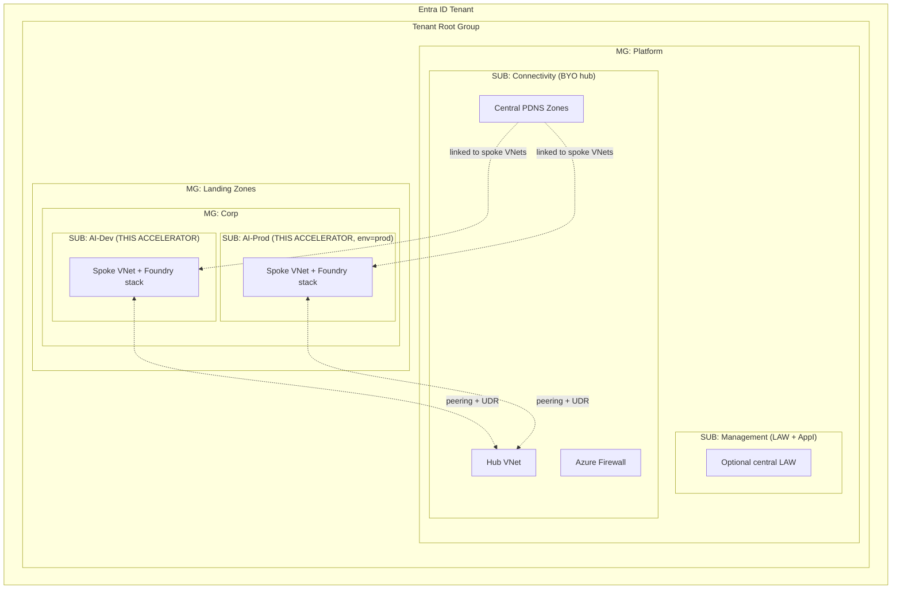
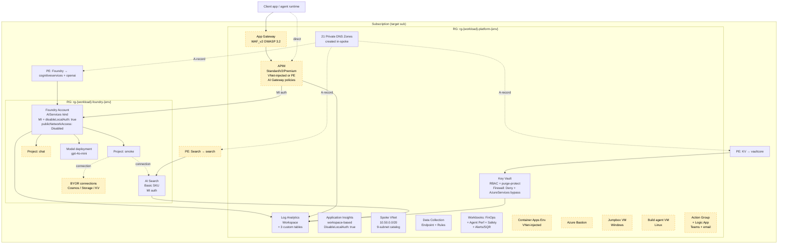
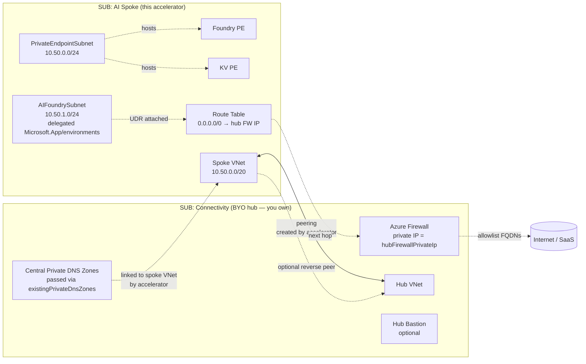
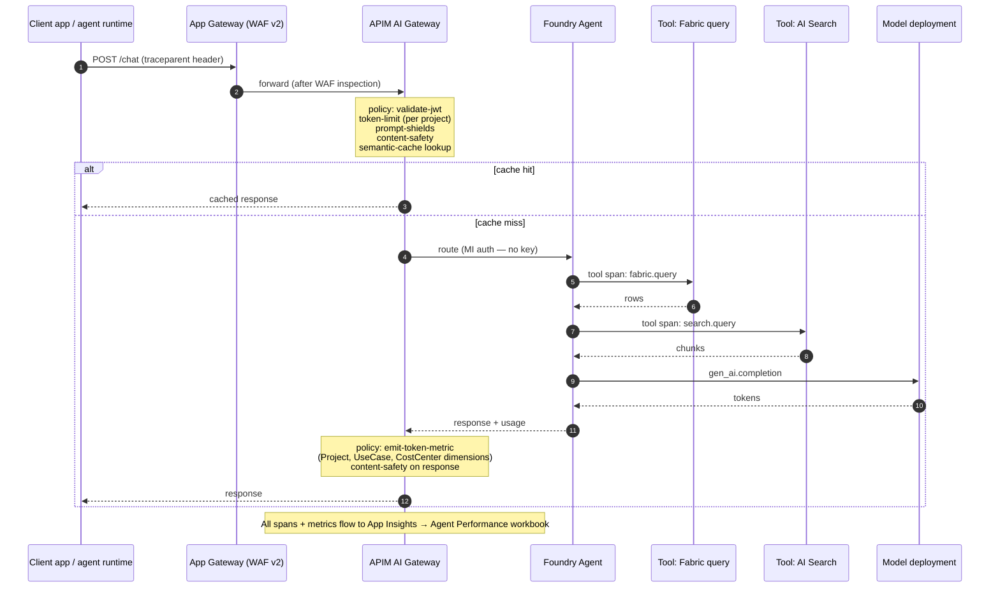
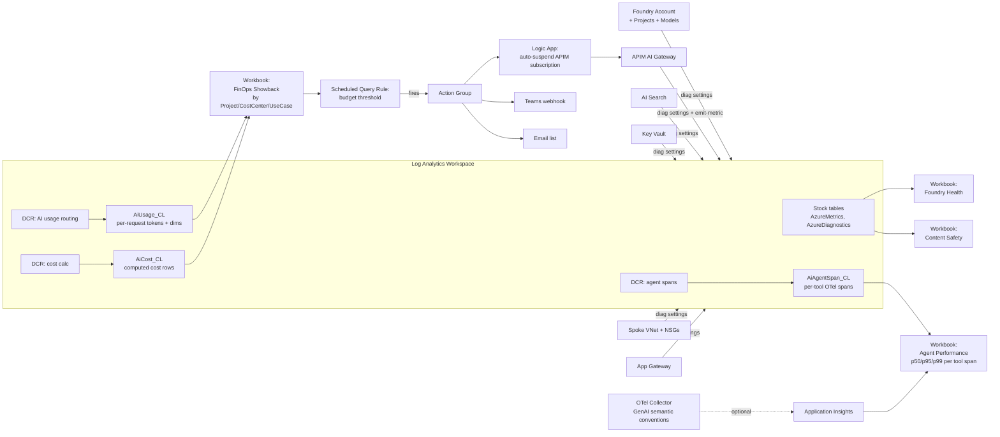

# Target architecture

This document describes the architecture deployed by the **Azure AI Foundry Landing Zone + FinOps Accelerator**. It covers:

1. [Subscription + management group layout](#1-subscription--management-group-layout)
2. [Spoke logical view — standalone mode (greenfield)](#2-spoke-logical-view--standalone-mode-greenfield)
3. [Spoke logical view — hub-connected mode (brownfield)](#3-spoke-logical-view--hub-connected-mode-brownfield)
4. [Subnet catalog (9 subnets, 8 active by default)](#4-subnet-catalog)
5. [Dataflow — request lifecycle](#5-dataflow--request-lifecycle)
6. [Dataflow — observability + FinOps pipeline](#6-dataflow--observability--finops-pipeline)
7. [Trust boundaries](#7-trust-boundaries)
8. [Cross-stack parity (Bicep ↔ Terraform)](#8-cross-stack-parity-bicep--terraform)

---

## 1. Subscription + management group layout

The accelerator is **subscription-scoped** — it deploys into a single subscription. You bring the management-group layout. A typical enterprise pattern:

| MG | Subscription | Role |
|---|---|---|
| `Platform` → Connectivity | `SUB-CONN` (BYO) | Hub VNet, Firewall, central Private DNS Zones |
| `Platform` → Management | `SUB-MGMT` (optional) | Central LAW if you aggregate cross-spoke logs |
| `Landing Zones` → Corp | `SUB-AI-DEV` | This accelerator's `env=dev` deploy |
| `Landing Zones` → Corp | `SUB-AI-PROD` | This accelerator's `env=prod` twin |

The accelerator's role assignments are scoped to the **target RGs only** (`rg-{workload}-platform-{env}`, `rg-{workload}-foundry-{env}`) — it does not require Owner at MG scope.

---

## 2. Spoke logical view — standalone mode (greenfield)

`networkMode = 'standalone'` — the accelerator creates everything end-to-end. No hub required.

**Legend:** dashed/amber boxes are gated by `components.*.deploy` toggles; solid boxes deploy unconditionally.

---

## 3. Spoke logical view — hub-connected mode (brownfield)

`networkMode = 'hub-connected'` — the spoke peers into your existing ALZ hub, skips PDNS creation in favor of linking to your central zones, and (optionally) sends `0/0` through your hub firewall.

**Inputs the spoke owner provides:**

| Param | How to get it |
|---|---|
| `hubVnetResourceId` | `az network vnet show -g <hub-rg> -n <hub-vnet> --query id -o tsv` |
| `hubFirewallPrivateIp` | `az network firewall ip-config list -g <hub-rg> --firewall-name <fw> --query "[0].privateIpAddress" -o tsv` |
| `existingPrivateDnsZones` | Map of `<zone-name>` → `<resource-id>` for each PDNS zone in your hub. The accelerator creates a VNet link from spoke to each. |
| `enableForcedTunneling` | `true` (default) — creates the `0/0` UDR; set to `false` if your hub doesn't gate egress |
| `createReverseHubPeer` | `false` (default) — set to `true` only if the spoke principal has write rights on the hub VNet |

See [hub-spoke-integration.md](hub-spoke-integration.md) for the wiring runbook.

---

## 4. Subnet catalog

The 9-subnet catalog is **always allocated in address space**, but each subnet is **only created if its `components.<name>.deploy` toggle is true** (or it's an "always-on" subnet). This means you can land new compute later without re-IPing.

| # | Subnet | `components` toggle | Prefix | CIDR @ `10.50.0.0/20` | Purpose |
|---|---|---|---|---|---|
| 1 | `PrivateEndpointSubnet` | always on | /24 | `10.50.0.0/24` | All PE NICs land here |
| 2 | `AIFoundrySubnet` | always on (delegated `Microsoft.App/environments`) | /24 | `10.50.1.0/24` | Foundry agent VNet injection target |
| 3 | `ContainerAppEnvironmentSubnet` | `containerAppsEnv.deploy` | /23 | `10.50.2.0/23` | CAE workload subnet (needs `/23` minimum) |
| 4 | `AppGatewaySubnet` | `appGateway.deploy` | /24 | `10.50.4.0/24` | AppGW WAF_v2 |
| 5 | `APIMSubnet` | `apim.deploy` + VNet mode | /26 | `10.50.5.0/26` | APIM VNet injection (external or internal) |
| 6 | `DevOpsBuildSubnet` | `buildvm.deploy` | /26 | `10.50.5.64/26` | Linux build agent |
| 7 | `JumpboxSubnet` | `jumpvm.deploy` | /26 | `10.50.5.128/26` | Windows ops jumpbox |
| 8 | `AzureBastionSubnet` | `bastion.deploy` | /26 | `10.50.5.192/26` | Bastion (subnet name is mandatory) |
| 9 | `AzureFirewallSubnet` | reserved (greenfield hub blueprint = P9 carryover) | /26 | `10.50.6.0/26` | Reserved for future standalone-with-firewall mode |

**Notes:**
- `AIFoundrySubnet` is created with `Microsoft.App/environments` delegation regardless of whether CAE is enabled — Foundry agent VNet injection needs the delegation marker.
- `APIMSubnet` is only created when APIM is deployed *and* the network mode is VNet (`external` or `internal`). For PE-mode APIM, no subnet is consumed in this slot.
- `AzureBastionSubnet` is the only subnet name dictated by Azure (Bastion service requires this exact name); the other 8 are convention.
- The two `/24`s for PE and AIFoundry are sized for ~250 endpoints each — typical enterprise scale is well under that.
- Address space is **fully allocated even if subnets are off** to prevent re-IP when toggles flip on later.

---

## 5. Dataflow — request lifecycle

Below: a client app calls an agent that uses **two tools (Fabric query + AI Search)** and a **GPT model**, with APIM AI Gateway in front.

**Why this matters:**
- The `emit-token-metric` policy attaches **per-request dimensions** (`Project`, `UseCase`, `CostCenter`) so the FinOps workbook can break burn down by team without sampling Cost Management.
- `semantic-cache` (Azure Redis Enterprise via vector index) cuts repeat-query cost ~30-60% depending on workload.
- `prompt-shields` + `content-safety` give you the "Microsoft Azure AI Content Safety" enterprise SLAs end-to-end.
- The agent's per-tool spans (Fabric, Search, Model) are visible separately in the workbook — when latency is bad you immediately know if it's the network, Fabric, Search, or the model itself.

---

## 6. Dataflow — observability + FinOps pipeline

**Key design choices:**
- **Custom LA tables** (`*_CL`) drive per-project cost lineage — far cheaper than streaming raw Cost Management exports.
- **DCRs route metrics** from APIM's `emit-token-metric` policy directly into the custom tables.
- **Workbooks query LAW** (not Cost Management) — fast, no API throttling.
- **Auto-suspend Logic App** is opt-in (`components.notifications.deploy = true`) and idempotent — it disables the offending APIM subscription, not the whole gateway.
- **OTel collector** is also opt-in — you wire your existing collector to ship spans to AppI; the workbook works either way.

---

## 7. Trust boundaries

| Boundary | Defense |
|---|---|
| **Internet → Spoke** | App Gateway WAF_v2 OWASP 3.2 in Prevention mode (when `appGateway.deploy=true`) |
| **App → APIM** | OAuth/JWT validation via APIM policy; per-subscription rate limit; token-limit policy |
| **APIM → Foundry** | Managed identity, MI granted `Cognitive Services User` at Foundry account scope; `disableLocalAuth=true` blocks API-key fallback |
| **App → Storage/KV/Search direct** | Blocked by `publicNetworkAccess=Disabled` on Foundry + Search + KV firewall Deny; resolved only via in-spoke Private Endpoints |
| **Spoke → Internet** | If `hub-connected`: forced through hub firewall via `0/0` UDR. If `standalone`: no egress control (POC posture) |
| **Operator → Spoke** | Bastion + Jumpbox (when toggled on); no public RDP/SSH |
| **Data-plane CMEK** | KV holds CMK keys; Foundry encryption with CMK is opt-in (P9: not yet wired in either stack) |
| **Identity** | All MIs assigned via accelerator; no service principals with client secrets are created |
| **Policy** | The 12-control initiative under `policy/` audits all of the above continuously |

---

## 8. Cross-stack parity (Bicep ↔ Terraform)

Both stacks deploy the **same architecture**. The CI parity test (`scripts/parity-diff.ps1`) asserts the resource graphs match within a documented allowlist. The current systemic asymmetries:

| Type | TF − Bicep | Why |
|---|---|---|
| `Microsoft.Insights/actionGroups` | **+1** | TF always creates an AG; Bicep gates behind `notifications.deploy` |
| `Microsoft.Insights/dataCollectionRules` | **−2** | TF ports only 1 of 3 FinOps DCRs (P9 carryover) |
| `Microsoft.Insights/diagnosticSettings` | **−5** | Bicep applies diag on KV + 2 NSGs + VNet + Search; TF only on Foundry (P9 carryover) |
| `Microsoft.Insights/workbooks` | **−1** | Bicep has FinOps + Agent Perf; TF has FinOps only (P9 carryover) |
| `Microsoft.Network/privateEndpoints` | **−1** | TF skips KV PE in smoke posture |
| `Microsoft.Network/privateEndpoints/privateDnsZoneGroups` | **−2** | TF inlines `private_dns_zone_group{}` in `azurerm_private_endpoint`; Bicep emits a child resource. Same runtime behavior, different ARM shape. |

All of these are tracked in [`docs/lint-baseline.md`](lint-baseline.md) and [`docs/parity-allowlist.json`](parity-allowlist.json). When the P9 carryover work lands, the TF stack will close the diff.

---

## Implementation notes

- **`cidrSubnet(network, newCIDR, idx)`** — `newCIDR` is the **absolute new prefix length** (24 → `/24`), not bits-to-add. Got this wrong twice during initial bring-up; live deploy was the only thing that caught it (`az deployment sub validate` skips nested-module expansion when the parent uses runtime references).
- **AVM modules** — Foundry stack uses [`Azure/avm-ptn-aiml-foundry-account`](https://registry.terraform.io/modules/Azure/avm-ptn-aiml-foundry-account/azurerm/latest) in Terraform; Bicep uses native resources + AVM where coverage exists.
- **Subscription scope** — `main.bicep` and `infra/terraform/main.tf` both deploy at **subscription scope**. They create the 2 RGs themselves. Don't pre-create them.
- **Region pinning** — search defaults to `westus2` (Basic SKU capacity in `eastus2` is constrained); APIM and everything else defaults to `eastus2`. Override via `location` + `searchLocation` parameters.
