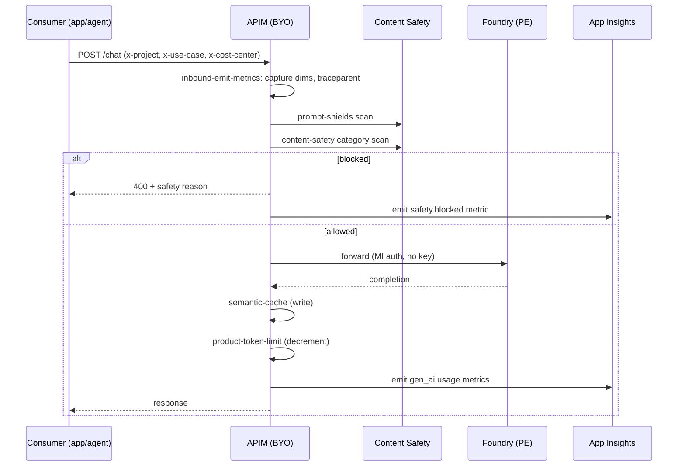

# Existing APIM — Bring Your Own (BYO) Integration

> Audience: a platform team that already runs APIM and wants to wire the accelerator's AI Gateway policies in without redeploying.
> Scope: how to wire the accelerator's AI Gateway policies into an existing
> APIM instance (referred to below as `<your-apim>`) without redeploying it.

The accelerator ships an opinionated **AI Gateway policy set** under
[`apim-policies/`](../apim-policies/). If your platform team already owns an APIM
instance with corporate routing, OAuth, and CMK in place — you don't need to
redeploy it. This doc describes the minimal import / wiring path.

## When to use this doc vs. the KLZ-deployed APIM

| You want | Path | How |
|---|---|---|
| Keep your existing APIM, just add KLZ's AI Gateway policies | **This doc** | Import the XMLs in `apim-policies/` per section 1 |
| Let KLZ deploy a new APIM into the spoke for evaluation | `components.apim.deploy = true` in your bicepparam | See `infra/bicep/parameters/full.bicepparam` for the `StandardV2` PE-mode example |
| Same as above but APIM joins the spoke VNet (no PE) | `components.apim.deploy = true` + `apim.networkMode = 'external'` *or* `'internal'` | 🚧 Stage B — APIM SKU widening + VNet-injection toggle |

> The KLZ-deployed APIM uses the **same policy XMLs** referenced below;
> only the deploy mechanism differs. Whichever path you pick, the
> consumer-side header contract in section 4 is identical.

## 1. What you import (in order)

| Policy XML | APIM scope | Purpose | Required headers |
|---|---|---|---|
| [`inbound-emit-metrics.xml`](../apim-policies/inbound-emit-metrics.xml) | **Global (service)** | Emit `gen_ai.*` token + cost metrics to App Insights with `Project`, `UseCase`, `CostCenter` dimensions | `x-project`, `x-use-case`, `x-cost-center` |
| [`prompt-shields.xml`](../apim-policies/prompt-shields.xml) | **API** (per Foundry-backed API) | Run Azure AI Content Safety **Prompt Shields** on each request to detect jailbreaks + indirect injection | none |
| [`content-safety.xml`](../apim-policies/content-safety.xml) | **API** (per Foundry-backed API) | Run Content Safety category filters (Hate / Sexual / Violence / Self-harm) at threshold **Medium = block** | none |
| [`semantic-cache.xml`](../apim-policies/semantic-cache.xml) | **API** (per Foundry-backed API) | Token-cache identical prompts via vector similarity — cuts cost on repeated questions | none |
| [`product-token-limit.xml`](../apim-policies/product-token-limit.xml) | **Product** (per consuming team / project) | Per-project TPM cap + 429 on overage. Pair with `inbound-emit-metrics.xml`. | none |

> **Why this order:** global emits metrics first, then API-scope policies run
> safety + caching, then product-scope enforces the per-team cap. Reordering
> breaks the dimension dictionary on the metric emit.

## 2. Pre-import checklist (run once on APIM)

| Item | Why | How |
|---|---|---|
| Add **App Insights** logger to APIM | `azure-openai-emit-token-metric` writes there | Portal → APIM → Application Insights → connect |
| Add **named values** for content-safety endpoint + key | Used by `content-safety.xml` and `prompt-shields.xml` | Portal → APIM → Named values → add `contentSafetyEndpoint` (URL) + `contentSafetyKey` (key vault reference, NOT inline) |
| Grant APIM **System-Assigned MI** the `Cognitive Services User` role on the Foundry account | Lets APIM call Foundry without keys | `az role assignment create --assignee <apim-mi> --role "Cognitive Services User" --scope <foundry-id>` |
| Create one **APIM Product** per project (`prj-knowledge-search`, etc.) | Token caps + showback | Portal → APIM → Products → Add |
| Create one **APIM Backend** per Foundry deployment (or use **AOAI backend pool** with multiple deployments) | Allows model failover + load-spreading | Portal → APIM → Backends |

## 3. Import procedure

### 3a. Inbound metrics (global)

```pwsh
$rg   = '<your-apim-rg>'
$apim = '<your-apim>'

# Replace the global policy. WARNING: this overwrites any existing global
# policy. Diff against current first.
az apim api policy create `
    --resource-group $rg `
    --service-name $apim `
    --value-format xml `
    --value "$(Get-Content -Raw apim-policies/inbound-emit-metrics.xml)" `
    --api-id ' '   # global scope sentinel
```

Or via the portal: APIM → All APIs → Policies → Inbound → Code view → paste.

### 3b. Per-API (Content Safety + Prompt Shields + Semantic Cache)

For each API that proxies Foundry (e.g. `openai-chat`, `openai-embeddings`):

```pwsh
az apim api policy create `
    --resource-group $rg `
    --service-name $apim `
    --api-id openai-chat `
    --value "$(Get-Content -Raw apim-policies/prompt-shields.xml)"
```

> Prompt Shields and Content Safety chain together. If you have an existing
> API policy, merge using `<base/>` inside `<inbound>`, not replace.

### 3c. Per-product (token limit)

```pwsh
az apim product policy create `
    --resource-group $rg `
    --service-name $apim `
    --product-id prj-knowledge-search `
    --value "$(Get-Content -Raw apim-policies/product-token-limit.xml)"
```

Tune `tokens-per-minute` per project in the XML before import.

## 4. Header contract for callers

Every consumer call must send:

```http
POST /openai/deployments/gpt-4o/chat/completions
Ocp-Apim-Subscription-Key: <project-subscription-key>
x-project: prj-knowledge-search
x-use-case: parts-lookup-chat
x-cost-center: 1234567890
Content-Type: application/json
```

Missing headers default to `unknown` and break per-project showback — flag
in App Insights with the workbook query in section 6.

## 5. What happens at request time (end-to-end)



## 6. Validation queries (App Insights / Log Analytics)

After import, run these to prove the wiring works:

```kusto
// Per-project token usage in the last hour
customMetrics
| where name == 'AiGateway.tokens.consumed'
| where timestamp > ago(1h)
| extend Project = tostring(customDimensions['ProjectName'])
| summarize tokens = sum(value) by Project
| order by tokens desc

// Safety block rate (should be > 0 if you import prompt-shields)
customMetrics
| where name == 'AiGateway.safety.blocked'
| summarize blocks = count() by bin(timestamp, 1h), tostring(customDimensions['category'])

// Calls missing the required headers (should trend to 0)
customMetrics
| where name == 'AiGateway.tokens.consumed'
| where customDimensions['ProjectName'] == 'unknown'
| summarize count() by bin(timestamp, 1h)
```

## 7. Rollback

Each policy is independently revertible:

```pwsh
# Revert global to bare <policies><inbound><base/></inbound>...</policies>
az apim api policy delete --resource-group $rg --service-name $apim --api-id ' '
```

Then re-apply your prior global policy from your APIM-as-code repo.

## 8. Known gotchas (carried from the policy XML headers)

- **`<base/>` is NOT valid at global scope** — global IS the root. Only use
  `<base/>` at API / product / operation scope.
- APIM C# expressions inside `@(...)`: **single quotes are char literals**.
  Multi-char strings must use double quotes; wrap XML attribute in single
  quotes so inner C# can use unescaped double quotes.
- `azure-openai-emit-token-metric` requires App Insights logger on the APIM
  service AND on the API. Both must be enabled or metrics silently drop.
- Content Safety key MUST be a **Key Vault reference named value**, not
  inline — inline keys break the WAF posture check in section 1.5 of the
  Foundry Enterprise Readiness doc.

## 9. References

- Source AI Gateway samples: <https://github.com/Azure-Samples/AI-Gateway>
- Foundry-Enterprise-Readiness.md → section 1.6 (AI Gateway requirements)
- deployment-guide.md → APIM section
