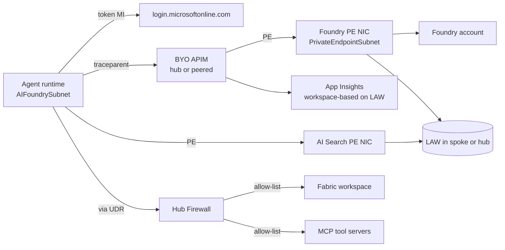

# Hub-and-Spoke Integration

> Audience: the network + platform team that owns your ALZ hub.
> Scope: how the accelerator's spoke (`rg-{workload}-platform-{env}` →
> `vnet-{workload}-{env}-<suffix>`) wires into an existing **Connectivity
> subscription** under a hub management group.

The accelerator deploys the Foundry, Search, Key Vault, and Document
Intelligence services with **Public Network Access = Disabled**. They are
unreachable until the spoke is peered and the Private DNS Zones are linked
into the hub. This doc is the integration runbook.

## 🚀 What's automated

Setting `networkMode = 'hub-connected'` in your bicepparam (or `network_mode = "hub-connected"` in `terraform.tfvars`) and supplying
three inputs makes the accelerator do sections 4a, 4b, 4d, and 8 in one
deploy. The manual procedure below is preserved for two reasons:

1. **Hub-side write ops** (creating the *reverse* hub→spoke peer, adding
   firewall application rules) usually require credentials the spoke team
   doesn't hold — those stay manual.
2. **Brownfield audits** where you want to verify each wiring step
   independently of the accelerator deploy.

The three inputs to provide in `parameters/enterprise-hub-connected.sample.bicepparam`:

| Param | Source |
|---|---|
| `hubVnetResourceId` | `az network vnet show -g $hubRg -n $hubVnet --query id -o tsv` |
| `hubFirewallPrivateIp` | `az network firewall ip-config list -g $hubRg --firewall-name $fw --query "[0].privateIpAddress" -o tsv` |
| `existingPrivateDnsZones` | Map of `zoneFriendlyName → resourceId` for each central zone. Friendly keys live in `infra/bicep/modules/networking/private-dns.bicep` |

Optional bring-up toggles:

| Param | Why |
|---|---|
| `enableForcedTunneling = false` (day 0) | Deploy hub-connected without the 0/0 UDR. Validate DNS + peering work first, then flip to `true` once firewall rules are in place. |
| `createReverseHubPeer = false` (default) | Skip the reverse peer if the hub lives in a different sub. The hub team usually creates the reverse peer out-of-band. |

The rest of this doc is the manual walkthrough.

## 1. What the accelerator delivers (spoke-side)

| Resource | Address space | Notes |
|---|---|---|
| `vnet-klzfin-dev-<suffix>` | `10.50.0.0/20` | Peering source. `suffix` is a 4-char `uniqueString()` derivation. |
| `PrivateEndpointSubnet` | `10.50.0.0/24` | PE subnet — `privateEndpointNetworkPolicies = Disabled` |
| `AIFoundrySubnet` | `10.50.1.0/24` | Foundry agent VNet-injection subnet, delegated to `Microsoft.App/environments` |
| `ContainerAppEnvironmentSubnet` | `10.50.2.0/23` | Created when `components.containerAppsEnv.deploy = true` |
| `AppGatewaySubnet` | `10.50.4.0/24` | Created when `components.appGateway.deploy = true` |
| `APIMSubnet` | `10.50.5.0/26` | Created when `components.apim.deploy = true` AND `apim.networkMode != 'none'` |
| `DevOpsBuildSubnet` | `10.50.5.64/26` | Created when `components.buildvm.deploy = true` |
| `JumpboxSubnet` | `10.50.5.128/26` | Created when `components.jumpvm.deploy = true` |
| `AzureBastionSubnet` | `10.50.5.192/26` | Created when `components.bastion.deploy = true` |
| `AzureFirewallSubnet` | `10.50.6.0/26` reserved | Reserved for the greenfield-hub blueprint (P9 carryover) |
| Private Endpoints | listed in section 3 | One per: Foundry, Key Vault (+ Search if same-region, + Storage / Doc Intel when those components are enabled) |

A route table is only created when `enableForcedTunneling = true` AND `hubFirewallPrivateIp` is set. NSGs are emitted per subnet (skipping `AzureFirewallSubnet` and `AzureBastionSubnet` per Azure rules).

## 2. Hub-side prerequisites (the platform team owns)

| Item | Why | Verification command |
|---|---|---|
| Hub VNet with **Azure Firewall** or **NVA** | Egress inspection for any outbound from agents | `az network vnet show -g $hubRg -n $hubVnet` |
| **Firewall private IP** documented | Becomes the UDR next hop (`hubFirewallPrivateIp`) | `az network firewall ip-config list -g $hubRg --firewall-name $fw --query "[0].privateIpAddress" -o tsv` |
| **Private DNS Zones** exist in hub RG (NOT in spoke) | The 21 PE zones must be central so peering scales | section 4 + the zoneCatalog in `modules/networking/private-dns.bicep` |
| Hub-to-spoke peering **allowed by NSGs/policy** | Some tenants enforce `Deny-AllNetworkPeerings` until reviewed | `az policy state list --filter "subscriptionId eq '<sub>'"` |
| **DNS Resolver / hub DNS forwarder** address documented | Spoke VNet `dnsServers` must point at the hub resolver, NOT Azure default | Confirm with network team |

## 3. Private Endpoints (deployed by the accelerator)

| Resource | PE name | DNS zone(s) needed in hub |
|---|---|---|
| Foundry account (`Microsoft.CognitiveServices/accounts`) | `pe-aif-klzfin-dev-...` | `privatelink.cognitiveservices.azure.com` **AND** `privatelink.openai.azure.com` (both auto-populated by the dns-zone-group when the `account` subresource is wired) |
| AI Search (`Microsoft.Search/searchServices`) | `pe-srch-klzfin-dev-...` | `privatelink.search.windows.net` (only deploys when `searchLocation == location` — see note below) |
| Key Vault (`Microsoft.KeyVault/vaults`) | `pe-kv-klzfin-dev-...` | `privatelink.vaultcore.azure.net` |
| Storage account (blob) | `pe-st-<workload>-<env>-...` *(if storage component enabled)* | `privatelink.blob.core.windows.net` |
| Application Insights (workspace-based — uses LAW PE) | `pe-ai-<workload>-<env>-...` *(if monitor PE enabled)* | `privatelink.monitor.azure.com`, `privatelink.oms.opinsights.azure.com`, `privatelink.ods.opinsights.azure.com`, `privatelink.agentsvc.azure-automation.net` |
| Document Intelligence | `pe-di-<workload>-<env>-...` *(if Doc Intel component enabled)* | `privatelink.cognitiveservices.azure.com` (shared with Foundry zone) |

> **Critical:** Foundry's `account` subresource maps to **two zones**:
> `privatelink.openai.azure.com` for `/openai/*` endpoints and
> `privatelink.cognitiveservices.azure.com` for the management/data plane.
> Both A records are emitted in one shot by the dns-zone-group when both
> zones are linked. Linking only one breaks SDK behavior in non-obvious ways.

> **Cross-region Search PE caveat:** Private Endpoints can't cross regions.
> The default `searchLocation = westus2` (because `eastus2` Basic capacity
> is constrained) means `pe-srch-…` is **skipped**, and Search keeps its
> public endpoint with an IP firewall. Set `searchLocation == location` if
> you want a PE for Search.

## 4. Wiring procedure (run in order — only needed if NOT using `networkMode='hub-connected'`)

### 4a. Peer spoke → hub (bidirectional)

```pwsh
$spokeSub  = '<spoke-subscription-id>'
$spokeRg   = 'rg-klzfin-platform-dev'
$spokeVnet = 'vnet-klzfin-dev-<suffix>'   # check actual suffix in your deploy outputs

$hubSub  = '<your-connectivity-sub-id>'
$hubRg   = '<your-hub-rg>'
$hubVnet = '<your-hub-vnet>'

az account set --subscription $spokeSub
$hubId = "/subscriptions/$hubSub/resourceGroups/$hubRg/providers/Microsoft.Network/virtualNetworks/$hubVnet"

az network vnet peering create `
    --resource-group $spokeRg `
    --vnet-name $spokeVnet `
    --name peer-to-hub `
    --remote-vnet $hubId `
    --allow-vnet-access `
    --allow-forwarded-traffic `
    --use-remote-gateways false

# Hub side (run with hub sub credentials)
az account set --subscription $hubSub
$spokeId = "/subscriptions/$spokeSub/resourceGroups/$spokeRg/providers/Microsoft.Network/virtualNetworks/$spokeVnet"
az network vnet peering create `
    --resource-group $hubRg `
    --vnet-name $hubVnet `
    --name peer-to-ai-spoke `
    --remote-vnet $spokeId `
    --allow-vnet-access `
    --allow-forwarded-traffic `
    --allow-gateway-transit
```

> **Automation:** when `networkMode='hub-connected'` the spoke→hub
> peer is created by `modules/networking/hub-peering.bicep`. The reverse
> peer is created by `modules/networking/hub-peering-reverse.bicep` only
> when `createReverseHubPeer = true` AND the hub is in the same sub.

### 4b. Link Private DNS Zones from hub to spoke

For each of the 21 zones (full list in `modules/networking/private-dns.bicep`), run **from the hub sub**:

```pwsh
$zones = @(
  'privatelink.openai.azure.com',
  'privatelink.cognitiveservices.azure.com',
  'privatelink.search.windows.net',
  'privatelink.vaultcore.azure.net',
  'privatelink.blob.core.windows.net',
  'privatelink.monitor.azure.com'
  # …plus the rest from the catalog you actually use
)
foreach ($z in $zones) {
  az network private-dns link vnet create `
    --resource-group $hubRg `
    --zone-name $z `
    --name "link-ai-spoke-dev" `
    --virtual-network $spokeId `
    --registration-enabled false
}
```

> **Do not create the zones in the spoke.** If they exist in both spoke and
> hub, resolution becomes nondeterministic.

> **Automation:** when `networkMode='hub-connected'` and you supply
> `existingPrivateDnsZones`, `modules/networking/private-dns.bicep` calls
> `private-dns-link.bicep` cross-RG for each zone you list — the spoke is
> linked back to your central zones without you running this loop.

### 4c. Point spoke VNet at hub DNS

```pwsh
az account set --subscription $spokeSub
az network vnet update `
    --resource-group $spokeRg `
    --name $spokeVnet `
    --dns-servers <hub-dns-resolver-private-ip>
```

> All existing PE NICs in the spoke must restart to pick up the new DNS
> (re-create the PE or restart the consuming resource). Verify with
> `nslookup <foundry-name>.openai.azure.com` from a VM in the spoke — it
> must return a `10.50.0.x` (the PE NIC in `PrivateEndpointSubnet`), NOT
> the public IP.

### 4d. UDR — force egress through the hub firewall

```pwsh
$fwIp = '<hub-firewall-private-ip>'

az network route-table create -g $spokeRg -n rt-ai-spoke-egress
az network route-table route create -g $spokeRg --route-table-name rt-ai-spoke-egress `
    --name to-internet --address-prefix 0.0.0.0/0 `
    --next-hop-type VirtualAppliance --next-hop-ip-address $fwIp

# Attach to the agent subnet ONLY (PE subnet doesn't need it)
az network vnet subnet update -g $spokeRg --vnet-name $spokeVnet --name AIFoundrySubnet `
    --route-table rt-ai-spoke-egress
```

> **Automation:** when `enableForcedTunneling = true` (and
> `hubFirewallPrivateIp` is set) `modules/networking/route-table.bicep`
> creates a route table with the 0/0 → hub-FW route, then
> `modules/networking/udr-attach.bicep` PATCH-merges it onto every
> *active* workload subnet (PrivateEndpointSubnet is intentionally skipped
> — see gotchas).

### 4e. Firewall application rules (hub-side, the platform team owns)

Minimum allowlist for Foundry agents reaching tool endpoints:

| Source | Destination FQDN | Port | Purpose |
|---|---|---|---|
| `AIFoundrySubnet` | `*.openai.azure.com` | 443 | Foundry model calls (already private; rule only for tools that bypass PE) |
| `AIFoundrySubnet` | `*.cognitiveservices.azure.com` | 443 | Content Safety calls |
| `AIFoundrySubnet` | `*.search.windows.net` | 443 | AI Search calls |
| `AIFoundrySubnet` | `*.fabric.microsoft.com` | 443 | Example: tools that call external SaaS — replace with your own allowlist |
| `AIFoundrySubnet` | `login.microsoftonline.com` | 443 | MI token endpoint |
| `AIFoundrySubnet` | `<approved-MCP-server-FQDNs>` | 443 | Only if agent uses external MCP tools |

Deny everything else by default.

## 5. End-to-end network path



## 6. Validation (must all pass before declaring done)

| Check | Command | Expected |
|---|---|---|
| Peering shows `Connected` both directions | `az network vnet peering show` | `peeringState: Connected` on both |
| Foundry resolves to a spoke IP | `Resolve-DnsName <foundry-name>.openai.azure.com` from spoke VM | `10.50.0.x` (PE) — NOT a public IP |
| Public access still blocked | `az cognitiveservices account show ... --query properties.publicNetworkAccess` | `Disabled` |
| Agent egress traverses firewall | Firewall flow log shows AIFoundrySubnet source IP | One row per egress call |
| `nslookup` from internet returns public | `nslookup <foundry-name>.openai.azure.com` from a public network | resolves to `*.cognitive.microsoft.com` CNAME → public IP that returns 403 |
| Validation outputs | `az deployment sub show -n <deploy> --query "properties.outputs._validation_hubVnet.value" -o tsv` | `OK` (any other value means params are wrong) |

## 7. Rollback

```pwsh
# Unlink DNS zones from spoke
foreach ($z in $zones) {
  az network private-dns link vnet delete -g $hubRg -z $z -n link-ai-spoke-dev --yes
}
# Remove peering
az network vnet peering delete -g $spokeRg --vnet-name $spokeVnet -n peer-to-hub
az network vnet peering delete -g $hubRg  --vnet-name $hubVnet  -n peer-to-ai-spoke
# Spoke goes back to isolated; PE NICs still exist but unreachable from hub.
```

If you originally deployed with `networkMode='hub-connected'` you can flip the param file back to `standalone` and redeploy — the next pass will tear down the peer + UDR + cross-RG zone links, and create in-spoke zones in their place.

## 8. Known gotchas

- **Two zones for Foundry** — see warning in section 3. The SDK calls both
  `*.openai.azure.com` and `*.cognitiveservices.azure.com`. Missing either
  produces "DNS resolution succeeded but TLS failed" errors. The
  per-subresource zone map in `modules/networking/private-dns.bicep` keys
  both zones to the `account` group so the dns-zone-group emits both A
  records automatically.
- **App Insights workspace-based** uses the LAW PE; you do NOT need a
  separate App Insights PE. But you DO need three OMS / agentsvc /
  monitor zones linked to the spoke for the ingest endpoints.
- **`use-remote-gateways=true`** only if the hub has a VPN/ExpressRoute
  gateway. Setting it without a gateway in the hub breaks peering.
- **Foundry Agent VNet injection** requires `AIFoundrySubnet` to be
  delegated to `Microsoft.App/environments` AND have a `/26` minimum. The
  subnet catalog provisions a `/24` to give CAE headroom; smaller subnets
  silently fail at provisioning time.
- **Don't put a route table on `PrivateEndpointSubnet`.** PE NICs already
  have an implicit route to the resource; a UDR with `0.0.0.0/0 →
  firewall` will black-hole the response. The accelerator's
  `udrCandidateSubnets` derivation in `main.bicep` intentionally excludes
  it.
- **`cidrSubnet` argument is the absolute new prefix length**, not bits
  to add. `cidrSubnet('10.50.0.0/20', 24, 0)` = `10.50.0.0/24`. Got this
  wrong twice during initial bring-up; only live deploy catches the bug
  because `az deployment sub validate` skips nested-module expansion when
  the parent uses runtime references.

## 9. References

- `infra/bicep/parameters/enterprise-hub-connected.sample.bicepparam` — sample with `<REPLACE>` placeholders for the three hub inputs
- `infra/bicep/modules/networking/private-dns.bicep` — 21-zone catalog with friendly keys
- `infra/bicep/modules/networking/spoke-vnet.bicep` — 9-subnet catalog, NSG rules, delegations
- Foundry-Enterprise-Readiness.md → section 1.3 (private-by-default)
- Architecture diagram: docs/architecture.md
- Azure docs: <https://learn.microsoft.com/azure/private-link/private-endpoint-dns>
